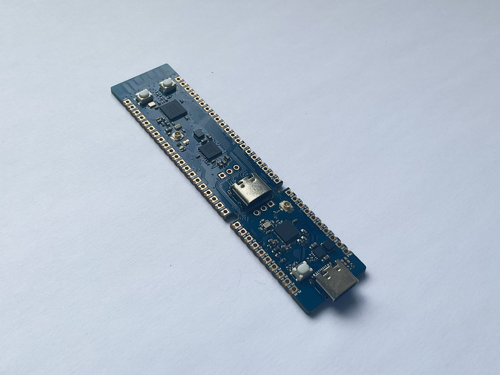
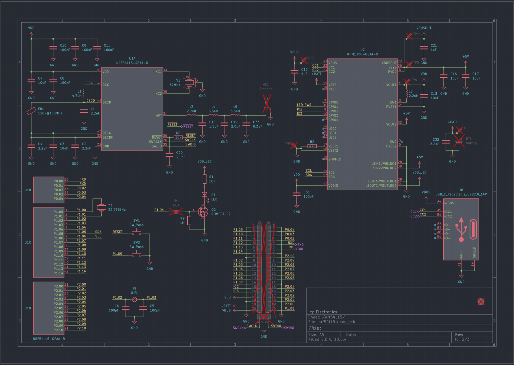
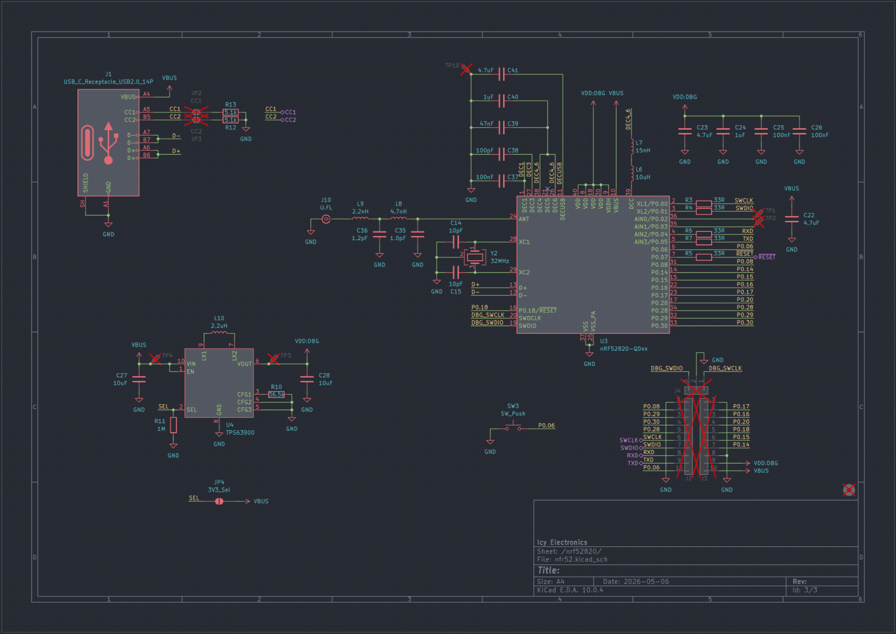
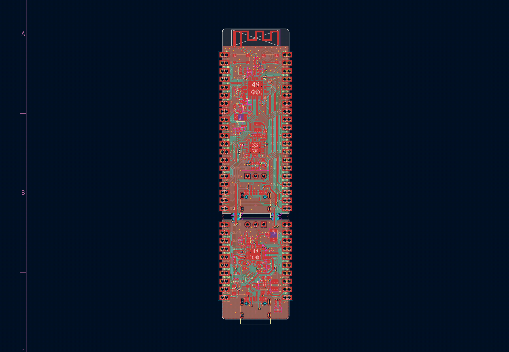
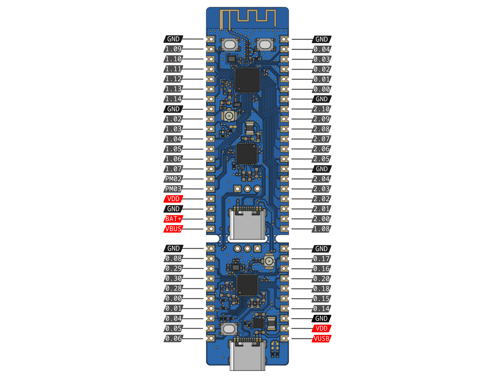

# nRF54L15 Discovery

The nRF54L15 Discovery board is a development kit designed around the nRF54L15 and nRF52820 multiprotocol Bluetooth low-power SoCs. In the normal configuration, the nRF52820 is used as an interface CMSIS-DAP MCU, enabling onboard debugging and programming, eliminating the need for external debuggers. The Interface MCU interfaces with the host via USB and exposes an SWD and UART bridge for development usage.

Both MCUs are connected via two mousebite bridges, which can be snapped in two, allowing both chips to be used separately. Both boards have standalone voltage regulators and have their own USB-C power supply connector.

The processors are paired with an nPM1300 PMIC that supports LiPo charging and a TPS63900 high-efficiency, low Iq buck-boost converter. Both voltage regulators can be configured for 1.8V or 3.3V, enabling a flexible operating voltage domain. The nPM1300 also negotiates USB-C PD with your charger and dynamically changes the battery charging rate.

It also has USB-C, LEDs, Buttons, and U.FL receptacles for a 2.4 GHz Antenna and a 13.56 MHz NFC Antenna. The SWD and UART headers are exposed via I/O pins.

### Key Features
- Nordic Semiconductor [nRF54L15](https://www.nordicsemi.com/Products/nRF54L15) SoC
    - 128 MHz Arm Cortex®-M33 processor and 128 MHz RISC-V coprocessor 
    - 1.5 MB NVM and 256 KB RAM
    - Multiprotocol 2.4 GHz radio supporting Bluetooth Low Energy, 802.15.4-2020, and 2.4 GHz proprietary modes (up to 4 Mbps)
    - Advanced security features with physical protection
    - Global RTC (GRTC) available in System OFF mode
    - 5x SPI/UART/I2C, 3x PWM, 2x QDEC, I2S, PDM, 14-bit ADC, GPIOs
    - Integrated NFC-A Tag
    - 0.7 μA to 2.9 μA sleep mode power consumption
    - U.FL NFC connector
- Nordic Semiconductor [nRF52820](https://www.nordicsemi.com/Products/nRF52820) SoC
    - 64 MHz Arm Cortex®-M4
    - 256 KB Flash and 32 KB RAM
    - Full Speed USB 2.0
    - Bluetooth Low Energy multiprotocol
    - U.FL 2.4GHz NFC Antenna
- [nPM1300](https://www.nordicsemi.com/Products/nPM1300) 500 nA PMIC with integrated 32-800mA LiPo battery charger
    - 200 mA buck-boost converter with 93% efficiency
    - 50 mA switchable LDO for LEDs (turn off for 0 current leakage)
    - 1.0-3.3V variable voltage configurable in 100 mV steps
    - 32-800 mA LiPo battery charger with power path
    - USB Type-C compliant with 100 mA, 500 mA, and 1500 mA current limit
- Up to 48 GPIOs (29 for nRF54L15, 15 for nRF52820, 2 for nPM1300)
- Shipped with CMSIS-DAP pre-flashed on the nRF52820, ready for direct use
- ARM Serial Wire Debug (SWD) port via edge pins and 3-pin header
- TPS63900 75 nA buck-boost converter with 1.8V/3.3V configurable power supply for I/Os
- USB-C, user LED and buttons
- Dual-row 40+20 pins in 91x21mm form factor with castellated edges
- Snappable into 2 individual devboards, all capable of standalone operations
- Supports Zephyr, nRF Connect SDK, Python, etc.

### Hardware Diagram

The hardware design files are also available on [GitHub](https://github.com/cheyao/nrf54l15-discovery/), licensed under the CERN OHL V2.

### Programming guide

The board is programmable out of the box. Just run `west flash -r pyocd` to flash the board.

To get started, just follow Zephyr's [Getting Started](https://docs.zephyrproject.org/latest/develop/getting_started/index.html) guide. Everything is the same, except replace `<your-board-name>` with `nrf54l15_discovery/nrf54l15/cpuapp/s` (or without the `/ns` for secure version).

### Where to Buy

The nRF54L15 Discovery is available on the following sites:

(Got some extra units; cost covers material costs)

| Item | Price |
| --- | ---- |
| PCB | $120 |
| PCBA | $230 |
